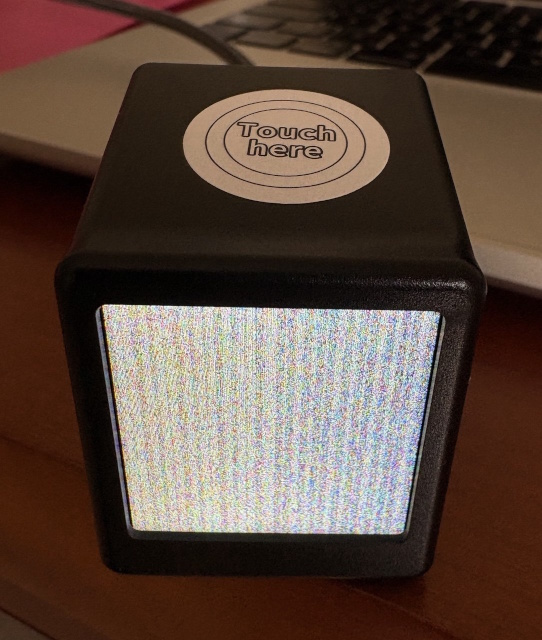

## Product Description

The GeekMagic SmallTV Pro is a LCD display designed to look like a mini computer.

It is USB-C powered and has an ESP32 inside.

The LCD panel has a 28x28mm size resulting in a 240x240 pixel resolution.

Available on [AliExpress](https://de.aliexpress.com/item/1005005132140010.html) at various vendors.

## Product Images

